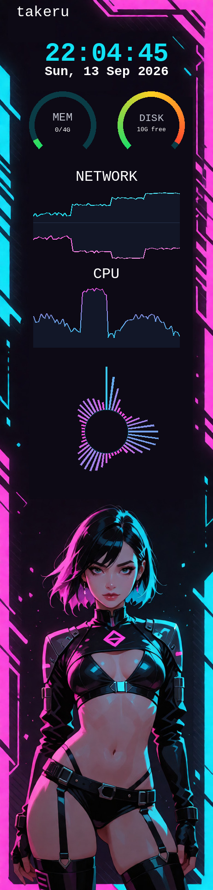

# akp02d

A themed stats display for the Ajazz AKP02 panel, built on the
[`akp02`](https://github.com/deonspengler/akp02) library.

> **Early build.** The theme format and the plugin API both still
> change without notice, and a release that renames an option will not
> warn you first. Expect to edit your theme when you update.



Needs `akp02` with the region-to-region settling delay (the panel drops
region updates sent too close together), `cava` for the spectrum
widget, and nothing else beyond Pillow and hidapi.

## Run

    python -m akp02d --check       # validate config and theme, no device
    python -m akp02d --stats -v    # run

## Themes

A theme is a directory with a `theme.toml`. The plugin name is the
array header, so a widget's own keys sit flat beside its geometry.
`id`, `x`, `y`, `width`, `height` and `fps` are reserved; the rest
belong to the plugin.

```toml
[theme]
orientation = "portrait"        # portrait | landscape
background = "#0d0a15"          # a colour
wallpaper = "panel.jpg"         # optional image, drawn over it
font = "DejaVuSans-Bold.ttf"    # theme-relative file, or a system family

[[widget.label]]
x = 80; y = 90; width = 302; height = 46
fps = 1
source = "time"                 # time | cpu | memory | disk | network
format = "{value:%H:%M:%S}"
size = 56
color = "#11e3f5"

[[widget.gauge]]
x = 56; y = 190; width = 160; height = 160
fps = 1
source = "memory"
label = "MEM"
format = "{used_gb:.0f}/{total_gb:.0f}G"
gradient = ["#22dd66", "#ffd022", "#ff3b30"]

[[widget.graph]]
x = 72; y = 400; width = 318; height = 160
fps = 5
source = "network"              # a pair: upload above, download below
scale = "log"                   # rates span orders of magnitude
max = 12500000                  # 100 Mbit, in bytes per second
origin = "#46506e"              # the centre line
fill = "#18243c"
fill_alpha = 0.45

[[widget.spectrum]]
x = 72; y = 772; width = 318; height = 318
fps = 30
type = "radial"                 # bars | mirrored | segmented | radial
bars = 48
peaks = true
gradient = ["#fd44dd", "#11e3f5"]
smoothing = 30                  # cava's noise_reduction, 0-100
```

`fps` is a rate, not a period: `1` is once a second, `30` every frame.
It sets how often a widget reads its source as well as how often it
redraws.

`source` and `format` are one mechanism. Python's format spec already
handles datetimes, so `"{value:%H:%M}"` and `"{percent:.0f}%"` compose
in one string, and a label with no source draws its format literally --
which is why static text needs no plugin of its own.

Any widget may lay its own `background` colour over the wallpaper at
`alpha` opacity. Text is centred on its cap-height band, so digits and
capitals sit true whatever the font.

`akp02d.toml` holds only what belongs to the machine: brightness, JPEG
quality and subsampling, and `inverted`, which describes how the panel
is mounted rather than how the theme looks.

## How a frame works

The loop ticks at a fixed rate. A widget is visited when its own `fps`
is due and redraws only if its value actually changed, so a fixed
string draws once at startup and a clock costs one redraw a second.

Everything that did change goes out as **one** region: the box covering
them all, cropped from a panel-sized composite the widgets paint into.
The driver makes each push wait out the panel's settle first -- about
10 ms, and per push rather than per byte -- so a second region in the
same frame costs more than the whole of a big one. One saved settle
buys roughly 80 KiB of payload and the entire panel encodes to about
20, so sending the unchanged pixels between widgets is far cheaper than
sending the widgets separately: a five-widget theme with everything due
at once measured 42.9 ms as separate pushes and 2.6 ms combined.

That box is also grown outward until its corner sits on a 16-pixel
boundary. JPEG lays its blocks out from the region's corner, so a box
that changes shape between frames would otherwise drag the block grid
across the picture and make the compression artefacts crawl.

## Layout rule

A region renders in true colour only when its offset along the
462-pixel axis satisfies the panel's alignment rule -- in landscape,
right way up, `(y + height) % 8 == 6`. The library corrects a violation
by nudging the region and warning every frame; akp02d rejects it at
load and names the nearest valid coordinate:

    widget 'label#2': y=20 with height=60 is not colour-safe;
    nearest colour-safe y for this size: 18 or 26

The residue is read off the library rather than hardcoded, and
`layout.py` is checked against the library's own arithmetic across
every coordinate and extent in both orientations and both mounts.

## Settings

One typed view over a TOML table serves the config, the themes and the
plugins alike. Every reader marks the keys it used and then rejects the
rest, so a misspelling fails at load with its full path instead of
silently doing nothing:

    unknown key(s) in widget.label[0]: colour
    widget.label[0].color: cannot read "octarine" as a colour
    widget 'graph#1': source 'time' produces a moment, but this widget
      needs scalar or a pair

`--strict` additionally turns library warnings into errors and
cross-checks every push against the box it claims.

## Writing a plugin

One module in `akp02d/plugins/`, a class decorated with `@register`,
and one import line in `plugins/__init__.py`. Most of what this panel
shows is a string that changes sometimes, and `Label` already handles
the font, colour, centring and change test:

```python
@register("hostname")
class HostnameWidget(Label):
    default_fps = 1 / 60

    def __init__(self, spec, theme):
        super().__init__(spec, theme)
        self._short = spec.options.boolean("short", True)
        spec.options.reject_unknown()

    def text(self, now: float) -> str:
        name = socket.gethostname()
        return name.split(".")[0] if self._short else name
```

Anything that is not a line of text subclasses `Widget` and implements
`render()`, returning `True` only when the pixels really changed --
decided by comparing the source value, not the pixels. The encode and
the USB transfer both hang off that boolean.

## Not yet

No hot reload. Stats are logged, not exported. Encode runs on the loop
thread. Sources are read per widget rather than shared, which suits
cheap local reads and will not suit an API call.
